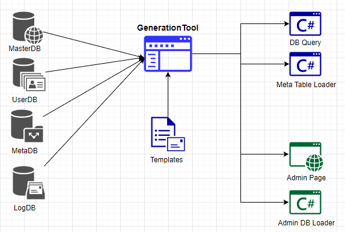

## 목표
- DB 테이블을 이용해 게임서버에서 사용하는 DB 로딩 로직 자동 생성
	- 기본 쿼리 자동 생성 (Select, Update, Insert, Upsert, Delete)
 	- Pk 확인을 통해 Param 설정
 	- Async로 동작되는 Query Class 생성.
  	- DB의 종류에 따라 생성 패턴 분리
- DB 테이블을 이용해 AdminTool 페이지 자동 생성
	- AdminTool 페이지도 Table 별로 유사한 패턴이 있음.
	- AdminTool 페이지 DB 로직 자동 생성
 	- DB의 종류에 따른 페이지 생성 분리
  		- UserDB는 Data Edit 기능
    		- MetaDB는 수정불가
  		- LogDB는 기간 검색을 위한 기간 설정 기능
- 최초 생성시 반복되는 작업을 최소화 하여 작업 효율 증가.
- 수정 작업시, Comment를 활용하여 작업간 호환성 제공
	- 삭제할 DBTable, Column에 대한 호환성 처리

## 구성


## 설정 및 동작
- 설정
	- 연결 DB 및 Table 설정
		- ConnectionString 구성
		- 연결할 DataBase 설정
	- Table 속성 설정
		- TableType에 따른 prefix, postfix를 구성하고 이에 맞는 속성 설정
		- ExcelDataTable, GameDataTable, UserTable, LogTable 구분
			- ExcelDataTable : 데이터의 연결 및 테이블 구성
			- UserTable : UserKey를 통한 검색 기능 
			- LogTable : 기간별 검색 기능
	- Data Column 속성
		- Column의 속성에 따라 ColumnType 구성
			- `_type`, `link_`, `_sid` 키워드 사용
		- Enum 타입 : Loader에서 변환 지원
		- Link 타입 : AdminTool에서 해당 데이터로 연결할 수 있는 Link 지원
- 기능
	- 보여질 페이지 및 기능 구성에 맞는 Template 제작
		- Liquid format에 맞춰 작업
	- DB 세부 속성 로딩
	- DB Table, Columns 데이터를 기능에 맞게 재구성
		- Template을 통해 코드 생성
	- 필요한 로직에 코드 복사 또는 Diff, Merge를 통해 사용

## 예시
#### 입력 테이블
- DB Table
```sql
CREATE TABLE `gt_user` (
	`gsn` BIGINT(20) UNSIGNED NOT NULL AUTO_INCREMENT,
	`inbox_info_idx` BIGINT(20) UNSIGNED NOT NULL DEFAULT '0' COMMENT '운영툴 Inboxinfo 설정 처리 Idx',
	`inbox_idx` BIGINT(20) UNSIGNED NULL DEFAULT '0' COMMENT '유저가 확인한 Inbox Idx',
	`play_date` DATETIME NULL DEFAULT '1970-01-01 00:00:00' COMMENT '?',
	`login_date` DATETIME NULL DEFAULT '1970-01-01 00:00:00' COMMENT '로그인 시간',
	`inventory_size` INT(10) NULL DEFAULT '50' COMMENT '인벤토리 사이즈',
	`last_play_mode` SMALLINT(5) NOT NULL DEFAULT '0' COMMENT '마지막 플레이한 모드정보',
	`base_item_reward_date` DATETIME NOT NULL DEFAULT '1970-01-01 00:00:00' COMMENT '초기지급 아이템 지급 시간',
	`quest_episode` INT(10) NOT NULL DEFAULT '0' COMMENT '진행중인 에피소드 번호',
	`town_location_x` FLOAT NULL DEFAULT '0',
	`town_location_z` FLOAT NULL DEFAULT '0',
	`town_location_r` FLOAT NULL DEFAULT '0',
	PRIMARY KEY (`gsn`) USING BTREE
);
```
#### 출력 결과
- Query
```cs
using System;
using System.Collections.Generic;
using System.Data;
using System.Data.Common;
using System.Text;
using System.Linq;
using CommonLib;
using CommonLib.Database;
using CommonLib.Database.Data;
using static CommonLib.CommonDefine;

// 자동 생성된 코드 입니다.
namespace DB_Model
{
	public class gt_userData : ICSVLoader
	{
		public ulong	gsn { get; set; }	//gsn, , PRI
		public ulong	inboxInfoIdx { get; set; }	//inbox_info_idx, 운영툴 Inboxinfo 설정 처리 Idx, 
		public ulong	inboxIdx { get; set; }	//inbox_idx, 유저가 확인한 Inbox Idx, 
		public DateTime	playDate { get; set; }	//play_date, ?, 
		public DateTime	loginDate { get; set; }	//login_date, 로그인 시간, 
		public int	inventorySize { get; set; }	//inventory_size, 인벤토리 사이즈, 
		public short	lastPlayMode { get; set; }	//last_play_mode, 마지막 플레이한 모드정보, 
		public DateTime	baseItemRewardDate { get; set; }	//base_item_reward_date, 초기지급 아이템 지급 시간, 
		public int	questEpisode { get; set; }	//quest_episode, 진행중인 에피소드 번호, 
		public float	townLocationX { get; set; }	//town_location_x, , 
		public float	townLocationZ { get; set; }	//town_location_z, , 
		public float	townLocationR { get; set; }	//town_location_r, , 
		
		// Generator Query
		public const string SelectQueryBase = "SELECT `gsn`, `inbox_info_idx`, `inbox_idx`, `play_date`, `login_date`, `inventory_size`, `last_play_mode`, `base_item_reward_date`, `quest_episode`, `town_location_x`, `town_location_z`, `town_location_r` FROM gt_user "
		public const string SelectQuery = "SELECT `gsn`, `inbox_info_idx`, `inbox_idx`, `play_date`, `login_date`, `inventory_size`, `last_play_mode`, `base_item_reward_date`, `quest_episode`, `town_location_x`, `town_location_z`, `town_location_r` FROM gt_user WHERE `gsn` = @0"
		public const string InsertQuery = "INSERT INTO gt_user ( `gsn`, `inbox_info_idx`, `inbox_idx`, `play_date`, `login_date`, `inventory_size`, `last_play_mode`, `base_item_reward_date`, `quest_episode`, `town_location_x`, `town_location_z`, `town_location_r` ) VALUES ( @0, @1, @2, @3, @4, @5, @6, @7, @8, @9, @10, @11 )";
		public const string InsertQueryList = "INSERT INTO gt_user ( `gsn`, `inbox_info_idx`, `inbox_idx`, `play_date`, `login_date`, `inventory_size`, `last_play_mode`, `base_item_reward_date`, `quest_episode`, `town_location_x`, `town_location_z`, `town_location_r` ) VALUES " 
		public const string UpsertQuery = "INSERT INTO gt_user ( `gsn`, `inbox_info_idx`, `inbox_idx`, `play_date`, `login_date`, `inventory_size`, `last_play_mode`, `base_item_reward_date`, `quest_episode`, `town_location_x`, `town_location_z`, `town_location_r` ) VALUES ( @0, @1, @2, @3, @4, @5, @6, @7, @8, @9, @10, @11 )ON DUPLICATE KEY UPDATE `inbox_info_idx` = @1, `inbox_idx` = @2, `play_date` = @3, `login_date` = @4, `inventory_size` = @5, `last_play_mode` = @6, `base_item_reward_date` = @7, `quest_episode` = @8, `town_location_x` = @9, `town_location_z` = @10, `town_location_r` = @11 ";
		public const string UpsertQueryList = "INSERT INTO gt_user ( `gsn`, `inbox_info_idx`, `inbox_idx`, `play_date`, `login_date`, `inventory_size`, `last_play_mode`, `base_item_reward_date`, `quest_episode`, `town_location_x`, `town_location_z`, `town_location_r` ) VALUES " 
		public const string UpsertQueryListColumns = " AS gt_userValue ON DUPLICATE KEY UPDATE `inbox_info_idx` = gt_userValue.inbox_info_idx, `inbox_idx` = gt_userValue.inbox_idx, `play_date` = gt_userValue.play_date, `login_date` = gt_userValue.login_date, `inventory_size` = gt_userValue.inventory_size, `last_play_mode` = gt_userValue.last_play_mode, `base_item_reward_date` = gt_userValue.base_item_reward_date, `quest_episode` = gt_userValue.quest_episode, `town_location_x` = gt_userValue.town_location_x, `town_location_z` = gt_userValue.town_location_z, `town_location_r` = gt_userValue.town_location_r ";
		public const string UpdateQuery = "UPDATE gt_user SET `inbox_info_idx` = @1, `inbox_idx` = @2, `play_date` = @3, `login_date` = @4, `inventory_size` = @5, `last_play_mode` = @6, `base_item_reward_date` = @7, `quest_episode` = @8, `town_location_x` = @9, `town_location_z` = @10, `town_location_r` = @11 WHERE `gsn` = @0";
		public const string DeleteQuery = "DELETE FROM gt_user WHERE `gsn` = @0";
		
		// Constructor
		public void gt_userData()
		{
			gsn = 0;
			inboxInfoIdx = 0;
			inboxIdx = 0;
			playDate = TimeUtil.GetUTC();
			loginDate = TimeUtil.GetUTC();
			inventorySize = 50;
			lastPlayMode = 0;
			baseItemRewardDate = TimeUtil.GetUTC();
			questEpisode = 0;
			townLocationX = 0;
			townLocationZ = 0;
			townLocationR = 0;
		}
		
		// Load
		public void Load(DbDataReader pReader)
		{
			gsn = (ulong) pReader.GetInt64(0);
			inboxInfoIdx = (ulong) pReader.GetInt64(1);
			inboxIdx = (ulong) pReader.GetInt64(2);
			playDate = pReader.IsDBNull(3) ? DateTime.MinValue : pReader.GetDateTime(3);
			loginDate = pReader.IsDBNull(4) ? DateTime.MinValue : pReader.GetDateTime(4);
			inventorySize = pReader.GetInt32(5);
			lastPlayMode = pReader.GetInt16(6);
			baseItemRewardDate = pReader.IsDBNull(7) ? DateTime.MinValue : pReader.GetDateTime(7);
			questEpisode = pReader.GetInt32(8);
			townLocationX = pReader.GetFloat(9);
			townLocationZ = pReader.GetFloat(10);
			townLocationR = pReader.GetFloat(11);
		}
		public void Load(DataRow pRow)
		{
			gsn = gsn = ulong.Parse(pRow[0].ToString());
			inboxInfoIdx = inboxInfoIdx = ulong.Parse(pRow[1].ToString());
			inboxIdx = inboxIdx = ulong.Parse(pRow[2].ToString());
			playDate = playDate = DateTime.Parse(pRow[3].ToString());
			loginDate = loginDate = DateTime.Parse(pRow[4].ToString());
			inventorySize = inventorySize = int.Parse(pRow[5].ToString());
			lastPlayMode = lastPlayMode = short.Parse(pRow[6].ToString());
			baseItemRewardDate = baseItemRewardDate = DateTime.Parse(pRow[7].ToString());
			questEpisode = questEpisode = int.Parse(pRow[8].ToString());
			townLocationX = townLocationX = float.Parse(pRow[9].ToString());
			townLocationZ = townLocationZ = float.Parse(pRow[10].ToString());
			townLocationR = townLocationR = float.Parse(pRow[11].ToString());
		}
	}
	
	// Select Query
	public class QuerySelectUser: IDirectQuery
	{
		public gt_userData data;

		public QuerySelectUser(ulong gsn, ulong gsn) 
		{
			QueryString = gt_userData.SelectQuery;
			AddParams(gsn, gsn);
		}
		public override void LoadData(DbDataReader r)
		{
			data = new gt_userData();
			data.Load(r);
		}
	}
	public class QuerySelectUserList : IDirectQuery
	{
		public List<gt_userData> datas = new List<gt_userData>();

		public QuerySelectUserList(string pOrderBy = "")
		{
			QueryString = gt_userData.SelectQueryBase + pOrderBy;
		}
		public override void LoadData(DbDataReader r)
		{
			gt_userData data = new gt_userData();
			data.Load(r);
			datas.Add(data);
		}
	}

	public class QuerySelectGSNUserList: IDirectQuery
	{
		public List<gt_userData> datas = new List<gt_userData>();

		public QuerySelectGSNUserList(ulong pGsn, string pOrderBy = "") 
		{
			QueryString = gt_userData.SelectListQuery + pOrderBy;
			AddParams(pGsn);
		}
		public override void LoadData(DbDataReader r)
		{
			gt_userData data = new gt_userData();
			data.Load(r);
			datas.Add(data);
		}
	}
	public class QuerySelectUserByIds: IDirectQuery
	{
		public Dictionary<ulong, List<gt_userData>> datas = new();

		public QuerySelectUserByIds(ulong pGsn, List<ulong> pIds) 
		{
			StringBuilder lQueryString = new StringBuilder(gt_userData.SelectQueryBase + $" WHERE gsn = {pGsn} AND gsn IN(");
			for (int i = 0; i < pIds.Count; ++i)
			{
				if (i == pIds.Count - 1) lQueryString.Append($"{pIds[i]});");
				else lQueryString.Append($"{pIds[i]}, ");
			}
			QueryString = lQueryString.ToString();
		}
		public override void LoadData(DbDataReader r)
		{
			gt_userData lData = new gt_userData();
			lData.Load(r);

			List<gt_userData> listDatas;
			if(false == datas.TryGetValue(lData.gsn, out listDatas))
			{
				listDatas = new();
				datas[lData.gsn] = listDatas;
			}
			listDatas.Add(lData);
		}
	}
	
	// Insert Query
	public class QueryInsertUser: IDirectQuery
	{
		public QueryInsertUser(gt_userData pData)
		{
			QueryString = gt_userData.InsertQuery;
			AddParams(ulong gsn, ulong gsn);
		}
		public QueryInsertUser(List<gt_userData> pDatas)
		{
			if (0 == pDatas.Count) { QueryString = ""; return; };
			isBulkQuery = true;
			StringBuilder lQueryParam = new StringBuilder();
			int lIndex = 0;
			foreach(var lData in pDatas)
			{
				lQueryParam.Append('(');
				lQueryParam.Append(lData.gsn);
				lQueryParam.Append(", ");
				lQueryParam.Append($"'{lData.playDate.ToString("yyyy-MM-dd HH:mm:ss")}'");
				lQueryParam.Append(", ");
				lQueryParam.Append($"'{lData.loginDate.ToString("yyyy-MM-dd HH:mm:ss")}'");
				lQueryParam.Append(", ");
				lQueryParam.Append(lData.inventorySize);
				lQueryParam.Append(", ");
				lQueryParam.Append(lData.lastPlayMode);
				lQueryParam.Append(", ");
				lQueryParam.Append($"'{lData.baseItemRewardDate.ToString("yyyy-MM-dd HH:mm:ss")}'");
				lQueryParam.Append(", ");
				lQueryParam.Append(lData.questEpisode);
				lQueryParam.Append(", ");
				lQueryParam.Append(lData.townLocationX);
				lQueryParam.Append(", ");
				lQueryParam.Append(lData.townLocationZ);
				lQueryParam.Append(", ");
				lQueryParam.Append(lData.townLocationR);
				lQueryParam.Append(')');
				if(0 != lIndex && 0 == lIndex % 200)
				{
					QueryList.Add(gt_userData.InsertQueryList + lQueryParam.ToString());
					lQueryParam.Clear();
				}
				else if(lIndex != pDatas.Count - 1)
				{
					lQueryParam.Append(", ");
				}
				lIndex++;
			}
			if(0 != lQueryParam.Length)
			{
				QueryList.Add(gt_userData.InsertQueryList + lQueryParam.ToString());
				lQueryParam.Clear();
			}
		}
	}
	
	// Update Query
	public class QueryUpdateUser: IDirectQuery
	{
		public QueryUpdateUser(gt_userData pData)
		{
			QueryString = gt_userData.UpdateQuery;
			AddParams(pData.gsn, pData.inbox_info_idx, pData.inbox_idx, pData.play_date, pData.login_date, pData.inventory_size, pData.last_play_mode, pData.base_item_reward_date, pData.quest_episode, pData.town_location_x, pData.town_location_z, pData.town_location_r);
		}
	}
	
	// Upsert Query
	public class QueryUpsertUser: IDirectQuery
	{
		public QueryUpsertUser(gt_userData pData)
		{
			QueryString = gt_userData.UpsertQuery;
			AddParams(pData.gsn, pData.inbox_info_idx, pData.inbox_idx, pData.play_date, pData.login_date, pData.inventory_size, pData.last_play_mode, pData.base_item_reward_date, pData.quest_episode, pData.town_location_x, pData.town_location_z, pData.town_location_r);
		}
		public QueryUpsertUser(List<gt_userData> pDatas)
		{
			if (0 == pDatas.Count) { QueryString = ""; return; };
			isBulkQuery = true;
			StringBuilder lQueryParam = new StringBuilder();
			int lIndex = 0;
			foreach(var lData in pDatas)
			{
				lQueryParam.Append('(');
				lQueryParam.Append(lData.gsn);
				lQueryParam.Append(", ");
				lQueryParam.Append($"'{lData.playDate.ToString("yyyy-MM-dd HH:mm:ss")}'");
				lQueryParam.Append(", ");
				lQueryParam.Append($"'{lData.loginDate.ToString("yyyy-MM-dd HH:mm:ss")}'");
				lQueryParam.Append(", ");
				lQueryParam.Append(lData.inventorySize);
				lQueryParam.Append(", ");
				lQueryParam.Append(lData.lastPlayMode);
				lQueryParam.Append(", ");
				lQueryParam.Append($"'{lData.baseItemRewardDate.ToString("yyyy-MM-dd HH:mm:ss")}'");
				lQueryParam.Append(", ");
				lQueryParam.Append(lData.questEpisode);
				lQueryParam.Append(", ");
				lQueryParam.Append(lData.townLocationX);
				lQueryParam.Append(", ");
				lQueryParam.Append(lData.townLocationZ);
				lQueryParam.Append(", ");
				lQueryParam.Append(lData.townLocationR);
				lQueryParam.Append(')');
				if(0 != lIndex && 0 == lIndex % 200)
				{
					QueryList.Add(gt_userData.UpsertQueryList + lQueryParam.ToString() + gt_userData.UpsertQueryUpdateColumns);
					lQueryParam.Clear();
				}
				else if(lIndex != pDatas.Count - 1)
				{
					lQueryParam.Append(", ");
				}
				lIndex++;
			}
			if(0 != lQueryParam.Length)
			{
				QueryList.Add(gt_userData.UpsertQueryList + lQueryParam.ToString() + gt_userData.UpsertQueryUpdateColumns);
				lQueryParam.Clear();
			}
		}
	}
	
	// Delete Query
	public class QueryDeleteUser: IDirectQuery
	{
		public QueryDeleteUser(ulong gsn, ulong gsn)
		{
			QueryString = gt_userData.DeleteQuery;
			AddParams(gsn, gsn);
		}
		public QueryDeleteUser(ulong gsn, List<int> pDatas)
		{
			isBulkQuery = true;
			StringBuilder lQueryParam = new StringBuilder();
			lQueryParam.Append($"DELETE FROM gt_user WHERE gsn = {gsn} AND gsn IN (");
			int lIndex = 0;
			foreach(var lData in pDatas)
			{
				lQueryParam.Append(lData);
				if(lIndex != pDatas.Count - 1)
				{
					lQueryParam.Append(", ");
				}
				lIndex++;
			}
			lQueryParam.Append(')');
			QueryString = lQueryParam.ToString();
		}
	}
}
```
- Result - Data Table Loader
```cs
using System;
using System.Collections.Generic;
using System.Data;
using System.Data.Common;
using System.Text;
using System.Linq;
using CommonLib.Database;
using CommonLib.Database.Data;
using static CommonLib.CommonDefine;

// 자동 생성된 코드 입니다.
// PK가 1개 이상인 경우 수작업으로 수정해야 합니다.
namespace CommonLib
{
	public class CharacterSpecDB
	{
	    private static readonly Lazy<CharacterSpecDB> _instance = new Lazy<CharacterSpecDB>(() => new CharacterSpecDB());

        public static CharacterSpecDB Instance
        {
            get
            {
                return _instance.Value;
            }
        }

        private FrozenDictionary<int, dt_characterData> _data = new Dictionary<int, dt_characterData>().ToFrozenDictionary();

        public OResult Load(MetaDB pMetaDB)
        {
            OResult lOResult = new();

            var lLoadResult = SpecTableUtil.Load<QuerySelectCharacterSpecList, dt_characterData>(pMetaDB, new QuerySelectCharacterSpecList(), "");
            if (lLoadResult.IsError) return lLoadResult.EBreak;
            var lDataTableList = (lLoadResult.value.query != null) ? lLoadResult.value.query.datas : lLoadResult.value.csvDataList;

            Dictionary<int, dt_characterData> lNewData = new();
            foreach (var data in lDataTableList)
            {
                lNewData.Add(data.characterId, data);
            }

            _data = lNewData.ToFrozenDictionary();

            return lOResult;
        }

        public OResultEx<dt_characterData> GetData(int pcharacterId, [CallerMemberName] string pCaller = "", [CallerLineNumber] int pLineNumber = 0)
        {
            OResultEx<dt_characterData> lOResultEx = new();

            if (_data.TryGetValue(pcharacterId, out var lValue) == true)
            {
                return lOResultEx.ReturnValue(lValue);
            }

            return lOResultEx.AlarmTableError(ResultCode.ItemInvalid, $"[{pCaller}:{pLineNumber}] : Not Found CharacterSpecDB { pcharacterId }");
        }
    }
}


```
- Result - Admin Loader
```cs
using System;
using System.Collections.Generic;
using System.Data;
using System.Data.Common;
using System.Text;
using System.Linq;
using CsvHelper;
using CommonLib;
using CommonLib.Database;
using CommonLib.Database.Data;
using static CommonLib.CommonDefine;

// 자동 생성된 코드 입니다.
namespace DB_Model
{
	public partial class GenDataBaseService
	{
		// Get
		public async Task<gt_userData> GetUserDataAsync(ulong pgsnulong pgsn)
		{
			using undefineDB lDBConnect = new ();
			QuerySelectUser lQuery = await lDBConnect.SelectQuery(new QuerySelectUser(pgsnpgsn));
			if (lQuery.resultCode != ResultCode.Success)
			{
				return new gt_userData();
			}
			return lQuery.data;
		}
		public async Task<List<gt_userData>> GetUserDataListAsync()
		{
			using undefineDB lDBConnect = new ();
			QuerySelectUserList lQuery = await lDBConnect.SelectQuery(new QuerySelectUserList());
			if (lQuery.resultCode != ResultCode.Success)
			{
				return new List<gt_userData>();
			}
			return lQuery.datas;
		}
		
		// Update (Upsert)
		public async Task<OResult> SetUserDataAsync(gt_userData pEditDate)
		{
			using undefineDB lDBConnect = new ();
			return await lDBConnect.RunQuery(new QueryUpdateUser(pEditDate));
		}
		public async Task<OResult> SetUserDataAsync(gt_userData pEditDate, string pAuthName)
		{
			Logger.Info($"SetUserDataAsync From {pAuthName}");
			using undefineDB lDBConnect = new ();
			return await lDBConnect.RunQuery(new QueryUpdateUser(pEditDate));
		}
		
		// Insert
		public async Task<OResultEx<ulong>> InsertUserDataAsync(gt_userData pEditDate)
		{
			OResultEx<ulong> oResultEx = new OResultEx<ulong>();
			using undefineDB lDBConnect = new ();
			var resultCode = await lDBConnect.RunQuery(new QueryInsertUser(pEditDate));
			oResultEx.value = lDBConnect.lastInsertedId;
			return oResultEx.Return(resultCode);
		}
		public async Task<OResultEx<ulong>> InsertUserDataAsync(gt_userData pEditDate, string pAuthName)
		{
			Logger.Info($"InsertUserDataAsync From {pAuthName}");
			OResultEx<ulong> oResultEx = new OResultEx<ulong>();
			using undefineDB lDBConnect = new ();
			var resultCode = await lDBConnect.RunQuery(new QueryInsertUser(pEditDate));
			oResultEx.value = lDBConnect.lastInsertedId;
			return oResultEx.Return(resultCode);
		}
		
		// Delete
		public async Task<OResult> DeleteUserDataAsync(ulong pgsnulong pgsn)
		{
			using undefineDB lDBConnect = new ();
			return  await lDBConnect.RunQuery(new QueryDeleteUser(pgsnpgsn));
		}
		public async Task<OResult> DeleteUserDataAsync(ulong pgsnulong pgsn, string pAuthName)
		{
			Logger.Info($"DeleteUserDataAsync From {pAuthName}");
			using undefineDB lDBConnect = new ();
			return  await lDBConnect.RunQuery(new QueryDeleteUser(pgsnpgsn));
		}
		
		// Upset
		public async Task<OResult> UpsetUserDataAsync(gt_userData pEditDate, bool log = true)
		{
			using undefineDB lDBConnect = new ();
			var lResult = await lDBConnect.RunQuery(new QueryUpsertUser(pEditDate), log);
			return lResult;
		}
		public async Task<OResult> UpsetUserDataAsync(gt_userData pEditDate, string pAuthName, bool log = true)
		{
			Logger.Info($"UpsetUserDataAsync From {pAuthName}");
			using undefineDB lDBConnect = new ();
			var lResult = await lDBConnect.RunQuery(new QueryUpsertUser(pEditDate), log);
			return lResult;
		}
	}
}
```
- Result - Admin Page(razor)
```java
using System;
using System.Collections.Generic;
using System.Data;
using System.Data.Common;
using System.Text;
using System.Linq;
using CsvHelper;
using CommonLib;
using CommonLib.Database;
using CommonLib.Database.Data;
using static CommonLib.CommonDefine;

@* =======================================*@
@* 기본페이지는 자동 생성됩니다. 용도에 맞게 수정해서 사용하세요. *@
@* =======================================*@
@* User Table 특징 *@
@* - 수정 가능 : EditTemplate *@
@* - 기능 : InsertRow, DownloadExcelFile, SearchResetBtnClick, LoadData *@
@* - 데이터 링크 : 해당 데이터로 이동 *@

@page "/user/gt_user"

@inherits CommonPage

@using DB_Model
@using GameNetworkProtocol
@using CommonLib
@using Microsoft.AspNetCore.WebUtilities
@inject IJSRuntime js
@using System.IO

<RadzenContent Container="main">
	<ChildContent>
		<RadzenText>gt_user</RadzenText>
		<RadzenButton Icon="file_download" style="margin-bottom: 10px" Text="Download Excel File" Click="@DownloadExcelFile" />
		<RadzenButton Icon="add_circle_outline" style="margin-bottom: 10px" Text="Add New" Click="@InsertRow" Disabled=@(temp_gt_user != null) />
		<RadzenButton ButtonStyle="ButtonStyle.Secondary" Icon="search_off" style="margin-left: " Click="@SearchResetBtnClick" />
		<RadzenButton ButtonStyle="ButtonStyle.Secondary" Icon="autorenew" style="margin-left: " Click="@LoadData" />
		
		<RadzenDataGrid @ref="dataGrid" Data="@gt_users" TItem="gt_userData" PagerPosition="PagerPosition.TopAndBottom" PagerHorizontalAlign=HorizontalAlign.Center AllowColumnPicking="true" AllowColumnResize="true" AllowFiltering="true" AllowPaging="true" EmptyText="No records to display." PageNumbersCount="10" PageSize="25"  IsLoading="@IsLoading" EditMode="DataGridEditMode.Single" Density="Density.Compact" ShowPagingSummary="true" >
			<Columns><RadzenDataGridColumn TItem="gt_userData" Frozen="true" Property="gsn" Title="gsn" Width="150px">
					<EditTemplate Context="edit_data">
					<RadzenNumeric @bind-Value="edit_data.gsn" Style="width: 100%" />" />
					</EditTemplate>
				</RadzenDataGridColumn><RadzenDataGridColumn TItem="gt_userData" Frozen="true" Property="inboxInfoIdx" Title="inbox_info_idx" Width="150px">
					<EditTemplate Context="edit_data">
					<RadzenNumeric @bind-Value="edit_data.inboxInfoIdx" Style="width: 100%" />" />
					</EditTemplate>
				</RadzenDataGridColumn><RadzenDataGridColumn TItem="gt_userData" Frozen="true" Property="inboxIdx" Title="inbox_idx" Width="150px">
					<EditTemplate Context="edit_data">
					<RadzenNumeric @bind-Value="edit_data.inboxIdx" Style="width: 100%" />" />
					</EditTemplate>
				</RadzenDataGridColumn><RadzenDataGridColumn TItem="gt_userData" Property="playDate" Title="play_date"  Width="200px" Filterable="false">
					<EditTemplate Context="edit_data">
					<RadzenDatePicker @bind-Value="edit_data.playDate" DateFormat="yyyy/MM/dd HH:mm:ss" Style="width: 100%" />" />
					</EditTemplate>
				</RadzenDataGridColumn><RadzenDataGridColumn TItem="gt_userData" Property="loginDate" Title="login_date"  Width="200px" Filterable="false">
					<EditTemplate Context="edit_data">
					<RadzenDatePicker @bind-Value="edit_data.loginDate" DateFormat="yyyy/MM/dd HH:mm:ss" Style="width: 100%" />" />
					</EditTemplate>
				</RadzenDataGridColumn><RadzenDataGridColumn TItem="gt_userData" Frozen="true" Property="inventorySize" Title="inventory_size" Width="150px">
					<EditTemplate Context="edit_data">
					<RadzenNumeric @bind-Value="edit_data.inventorySize" Style="width: 100%" />" />
					</EditTemplate>
				</RadzenDataGridColumn><RadzenDataGridColumn TItem="gt_userData" Frozen="true" Property="lastPlayMode" Title="last_play_mode" Width="150px">
					<EditTemplate Context="edit_data">
					<RadzenNumeric @bind-Value="edit_data.lastPlayMode" Style="width: 100%" />" />
					</EditTemplate>
				</RadzenDataGridColumn><RadzenDataGridColumn TItem="gt_userData" Property="baseItemRewardDate" Title="base_item_reward_date"  Width="200px" Filterable="false">
					<EditTemplate Context="edit_data">
					<RadzenDatePicker @bind-Value="edit_data.baseItemRewardDate" DateFormat="yyyy/MM/dd HH:mm:ss" Style="width: 100%" />" />
					</EditTemplate>
				</RadzenDataGridColumn><RadzenDataGridColumn TItem="gt_userData" Frozen="true" Property="questEpisode" Title="quest_episode" Width="150px">
					<EditTemplate Context="edit_data">
					<RadzenNumeric @bind-Value="edit_data.questEpisode" Style="width: 100%" />" />
					</EditTemplate>
				</RadzenDataGridColumn><RadzenDataGridColumn TItem="gt_userData" Frozen="true" Property="townLocationX" Title="town_location_x" Width="150px">
					<EditTemplate Context="edit_data">
					<RadzenNumeric @bind-Value="edit_data.townLocationX" Style="width: 100%" />" />
					</EditTemplate>
				</RadzenDataGridColumn><RadzenDataGridColumn TItem="gt_userData" Frozen="true" Property="townLocationZ" Title="town_location_z" Width="150px">
					<EditTemplate Context="edit_data">
					<RadzenNumeric @bind-Value="edit_data.townLocationZ" Style="width: 100%" />" />
					</EditTemplate>
				</RadzenDataGridColumn><RadzenDataGridColumn TItem="gt_userData" Frozen="true" Property="townLocationR" Title="town_location_r" Width="150px">
					<EditTemplate Context="edit_data">
					<RadzenNumeric @bind-Value="edit_data.townLocationR" Style="width: 100%" />" />
					</EditTemplate>
				</RadzenDataGridColumn><AuthorizeView>
					<Authorized>
						<RadzenDataGridColumn TItem="gt_userData" Context="BlazorModelsEdit" Filterable="false" Sortable="false" TextAlign="TextAlign.Center" Width="120px">
							<Template Context="edit_data">
								<RadzenButton Icon="edit" ButtonStyle="ButtonStyle.Light" Size="ButtonSize.ExtraSmall" Class="m-1" Click="@(args => EditRow(edit_data))" @onclick:stopPropagation="true"></RadzenButton >
							</Template>
							<EditTemplate Context="edit_data">
								<RadzenButton Icon="check" ButtonStyle="ButtonStyle.Primary" Size="ButtonSize.ExtraSmall" Class="m-1" Click="@((args) => SaveRow(edit_data))"></RadzenButton>
								<RadzenButton Icon="close" ButtonStyle="ButtonStyle.Light" Size="ButtonSize.ExtraSmall" Class="m-1" Click="@((args) => CancelEdit(edit_data))"></RadzenButton>
							</EditTemplate>
						</RadzenDataGridColumn> 
					</Authorized>
				</AuthorizeView>
			</Columns>
		</RadzenDataGrid>
	</ChildContent>
</RadzenContent>


```
- Result - Admin Page(razor.cs)
```cs

using DB_Model;
using Microsoft.AspNetCore.Components;
using Microsoft.AspNetCore.Components.Forms;
using Microsoft.AspNetCore.WebUtilities;
using Microsoft.JSInterop;
using OAdmin.Services.Custom.Admin;
using OAdmin.Models.Custom.Common;
using Radzen;
using Radzen.Blazor;
using Microsoft.AspNetCore.Components.Authorization;
using Session;
using CommonLib;
using CommonLib.Util;
using CommonLib.Database;
using CommonLib.Database.Data;
using static CommonLib.CommonDefine;

namespace OAdmin.Pages.User
{
	public partial class User : IDataLoader
	{
		[Inject] protected NavigationManager UriHelper { get; set; }
		[Inject] protected AdminSessionService AdminSessionService { get; set; }

		[Inject] public AuthenticationStateProvider AuthenticationStateProvider { get; set; }
		[Inject] protected NotificationService notificationService { get; set; }

		public ulong gsn { get; set; }

		private bool IsLoading = true;
		private gt_userData? temp_gt_user = null;

		private List<gt_userData>? gt_users = new();

		protected Radzen.Density Density = Radzen.Density.Default;
		protected RadzenDataGrid<gt_userData> dataGrid = new();
		
		public AuthLoginValue authLoginValue { get; set; } = new();

		[Parameter] public bool isLoad { get; set; } = true;


		protected override async Task OnInitializedAsync()
		{
			await base.OnInitializedAsync();
			var authState = await AuthenticationStateProvider.GetAuthenticationStateAsync();
			authLoginValue = dataBaseService.GetAuthLoginValueAsync(authState);

			if (isLoad) await LoadData();
		}

		public async Task LoadData()
		{
			gsn = await AdminSessionService.GetSearchGameUserIdAsync();
			if(gsn == 0)
			{
				gt_users = new();
				return;
			}
			gt_users = await genDataBaseService.GetGSNUserDataListAsync(gsn);
			StateHasChanged();
			IsLoading = false;
		}
		
		private async Task InsertRow()
		{
		    temp_gt_user = new();
		    await dataGrid.InsertRow(temp_gt_user);
		}
		private async Task EditRow(gt_userData data)
		{
		    temp_gt_user = data;
		    await dataGrid.EditRow(data);
		}
		private async Task SaveRow(gt_userData data)
		{
			await AddAdminLog(await AuthenticationStateTask, OadminActionType.UpdateRowData, "Edit User : " + JsonUtil.Serialize(data));

			await genDataBaseService.UpsetUserDataAsync(data);
			await dataGrid.UpdateRow(data);
			temp_gt_user = null;
		}
		private async Task CancelEdit(gt_userData data)
		{
		    gt_users = await genDataBaseService.GetGSNUserDataListAsync(data.gsn);
		    await dataGrid.Reload();
		    temp_gt_user = null;
		}
		
		private async Task DownloadExcelFile()
		{
			gt_users = await genDataBaseService.GetGSNUserDataListAsync(gsn);
			var excelBytes = dataBaseService.GetExcel(gt_users);
			await js.InvokeVoidAsync("saveAsFile", $"User_{DateTime.Now.ToString("MMdd_HHmmss")}.xlsx", Convert.ToBase64String(excelBytes));
		}
		
		private async Task SearchResetBtnClick()
		{
		    dataGrid.Reset();
		    await InvokeAsync(StateHasChanged);
		}
	}
}


```

## 사용 기술
- C# - Console
	- MySqlConnector
	- Fluid (Liquid)
- 결과물
	- Query : Select, Update, UpdateList, Upsert, UpsertList, Insert, InsertList, Delete, DeleteList, Truncate 지원
	- AdminPage : Blazor (razor, razor.cs)
