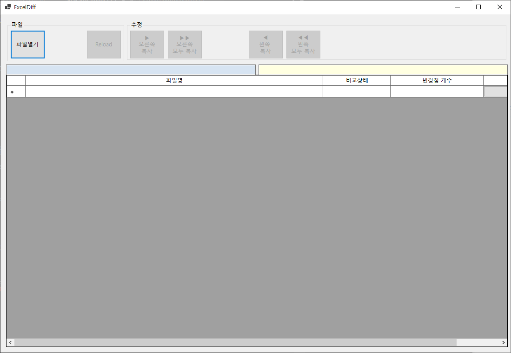
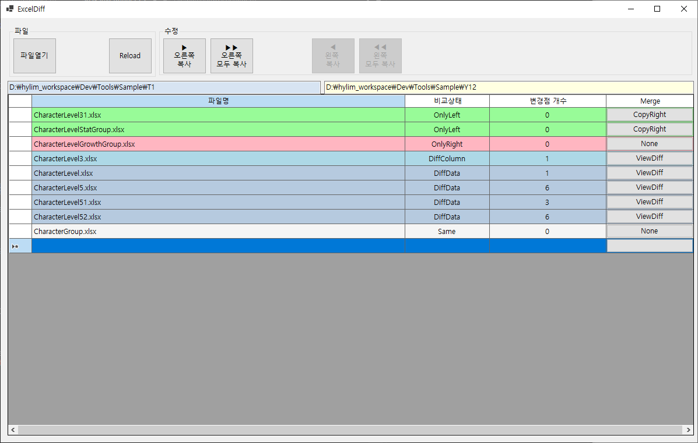
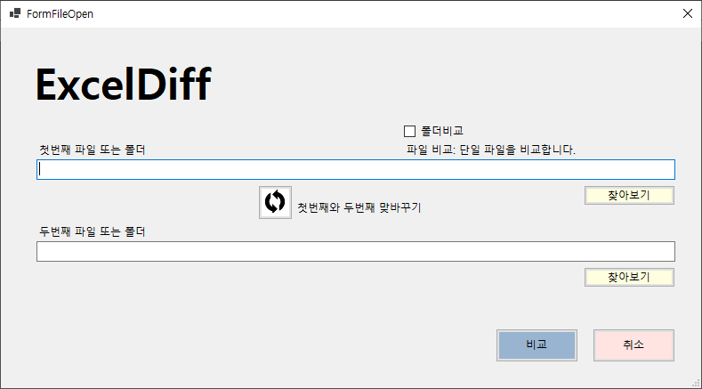
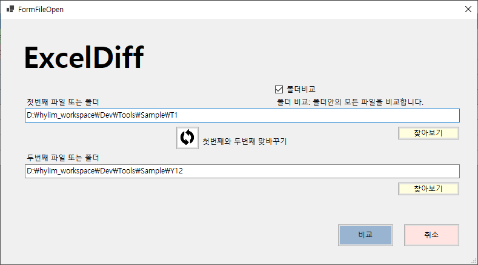
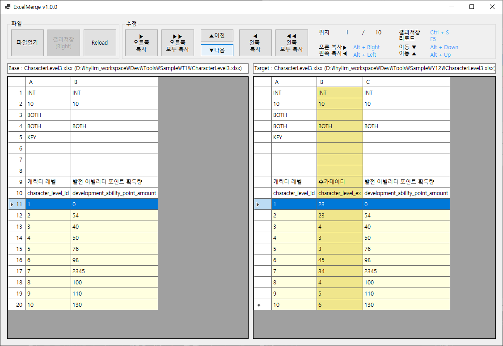
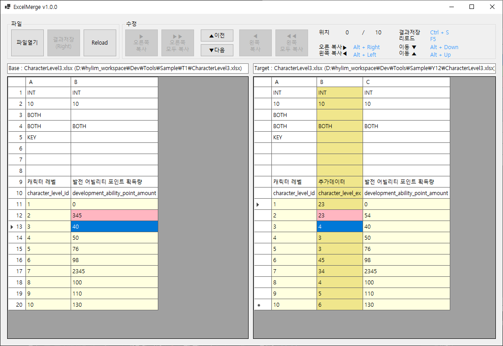

## Excel Diff Tool

### 목표
- Excel 데이터에 대한 Diff 및 Merge를 할 수 있는 Tool 제공
- 프로젝트 구성에 맞는 CustomTool을 위한 기본 기능 구현

### 구성
- 총 3개의 창으로 구성되어 있습니다.
- Main(FolderDiff)
    - 첫 화면으로 나오고, `파일열기`를 통해서 폴더 또는 파일을 비교 할 수 있습니다.
    - 폴더 비교시 비교 파일간 내용이 출력됩니다.
        - OnlyLeft : 왼쪽에만 있는 파일
        - OnlyRight : 오른쪽에만 있는 파일
        - DiffData, DiffColumn : 데이터가 다름
        - Merged : 편집한 파일 
        - Same : 동일한 파일
    - 더블클릭 또는 가장 우측의 버튼으로 동작합니다.
    - `오른쪽 복사` 기능 사용시 파일 복사를 수행합니다.
    - "DiffColumn", "DiffData", "Merged" 상태의 경우 FileDiff 창을 출력합니다.
    - `Reload` 기능 사용시 폴더의 내용을 다시 비교합니다.
    
    
- FileOpen
    - 비교를 위한 파일 또는 폴더 선택 창
        - `폴더비교`를 체크하면 `찾아보기`시 폴더 선택 창이 나옵니다.
    - 파일 선택시 파일 비교, 폴더 선택시 폴더내의 모든 파일을 비교 합니다.
    - Drag and Drop을 통해서 파일 또는 폴더 경로를 넣을 수 있습니다.
        - Drag 되는 내용에 따라 `폴더비교`체크 박스가 체크 됩니다.
    - "첫번째 파일 경로"와 "두번째 파일의 경로"를 교환 할 수 있습니다.
    
    
- FildDiff
    - 파일의 내용을 비교 합니다.
    - Row[0] ~ Row[10] 까지는 Header로 인식됩니다.
    - `오른쪽 복사` 기능 사용시 Row를 복사합니다.
    - `Reload` 기능 사용시 파일의 내용을 다시 읽어서 비교 합니다.
    - `이전`, `다음` 버튼으로 서로 다른 Row로 이동 됩니다.
        - `Alt + up`, `Alt + down`도 동일하게 동작됩니다.
    - Column의 추가 및 삭제의 경우 구현하지 않음
        - Column의 경우 Header, Data 정보를 분리해서 추가해야함
        - 중요한 변경사항이므로 DiffTool 보다 수작업으로 구성하고 Merge하는게 맞다고 판단됨
        - 실행 프로젝트에 따라서 추가 구현 필요
    
    

- Argument 실행
    - 실행시 Argument가 주어지는 경우 해당 Argument를 기반으로 FileDiff를 수행합니다.
    - SVN, Git등에서 DiffTool 등록을 해야 하는 경우 Argument를 분석해서 비교툴로 확장


### 사용법
#### 1. 직접 비교
- ExcelDiff 실행
- `파일 열기` 선택하여 파일 또는 폴더를 `찾아보기`, 또는 Drag and Drop을 통해서 설정
- `비교`를 통해서 비교
- 비교 화면에서 원하는 동작 수행
#### 2. SVN 등록
- SVN Setting 화면에서 ExcelDiff 등록
    - `Diff Viewer` > `Advanced ...` > `.xlsx` 확장자에 배포된 ExcelDiff.exe 등록
    ```
    "D:\Dev\Tools\ExcelDiff\bin\publish\ExcelDiff.exe" %base %mine
    ```
- SVN에 등록된 Excel 파일에서 `SVN` > `Diff` 선택시 File Diff 수행


### Diff 로직 동작
- FolderDiff
    - 두 폴더에서 "왼쪽에만 있는 파일", "오른쪽에만 있는 파일", "함께 있는 파일"을 구분합니다.
    - "함께 있는 파일"을 읽어서 FileDiff를 수행하고, Diff 상태를 출력합니다.
    ```
    // 파일 상태 정보
    None,
    OnlyLeft,   // 왼쪽에만 있는 파일
    OnlyRight,  // 오른쪽에만 있는 파일
    DiffColumn, // 컬럼이 다름
    DiffData,   // 데이터가 다름
    Merged,     // 복사되거나 편집된 상태
    Same,       // 내용이 동일한 파일
    ```
- FileDiff
    - 두개의 파일을 읽어서 비교를 진행합니다.
    - `Header`를 비교하면서 Column을 체크합니다.
    - `Key` 값을 비교해서 동일한 Row인지 확인합니다.
    - 동일한 Row의 경우 데이터가 동일한지 확인합니다.
    - 각 비교 상태에 따라 GridView에 출력합니다.
    - 다른 데이터의 경우 `이전`, `다음` 버튼으로 이동하며 Merge 기능을 수행할 수 있습니다.
    - GridView를 더블클릭하여, 하당 Cell을 원하는 데이터로 수정 가능합니다.
    - Excel에서 복사된 데이터를 `Ctrl+v` 로 복사할 수 있습니다.
    - 단축키를 이용해서 빠르게 수행할 수 있습니다.
    ```
    // Row 상태 정보
    None = 0,       // 같음
    Row = 1,        // 로우가 다름
    Column = 2,     // 데이터가 다름
    NoData = 3,     // 데이터가 없음
    Edited = 4,		// 편집됨
    ```
    ```
    // 단축키
    Alt + Right : 오른쪽 복사
    Alt + Left : 왼쪽 복사
    Alt + Up : 위로 이동
    Alt + Down : 다음 이동
    Ctrl + s : 저장
    F5 : 리로드
    ```


### TODO
- Column 이 다른 경우
    - Header 추가 : 반대편의 Header 정보 복사
        - Data의 경우 Default로 채우기
    - Header 삭제
        - Data도 삭제
- 로딩 경로 저장하여 File Open 창이 나올때 기본 경로 설정
- Config에 Header/ Data 설정 기능
- 폴더 비교, 변경점 개수 정상화
- Parameter를 받아서 FileDiff 출력
    - 연동되는 기능에 따라서 처리 (SVN)
- 파일 마우스 우클릭시 비교 (ExcelDiff) 메뉴 출력
        

