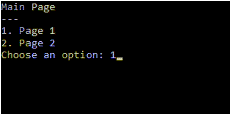
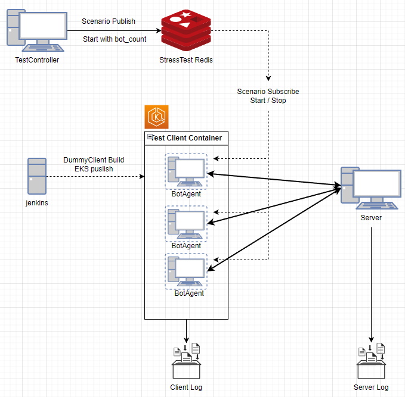

### 목표
- 기능 테스트를 위한 DummyClient 구현
	- 로직 구성을 StressTest의 Bot Logic에서도 함께 사용할 수 있도록 설계
- BotAgent 구성
	- 프로젝트의 성격에 맞게 실행
	- StressTestRedis를 구독하여 실행시 BotCount, Scenario, 서버 정보를 받아와 수행
	- BotCount 만큼 Thread를 생성하여 Scenario의 기능을 수행
	- 테스트 종료시 각각의 Bot이 ClientLog를 기록
- StressTest Model 구성
	- Test 환경 설정
	- Test Scenario 구성
	- 배포, 테스트 수행
	- 수행결과 리포트 구성

### DummyClient 구성
- EasyConsole 로 구성
	- 진입 시점부터 원하는 기능이 구성될 수 있도록 Tree 기반의 선택형 UI 구성
- Logic을 분리하여 BotAgent에서 사용될 수 있도록 설계 
- Client의 MetaData 구성
- 단일 클라이언트 기능 수행

### StressTest Model 
- Test 환경 설정
	- BotAgent가 동작할 PC는 jenkins에서 설정하여 실행
	- jenkins 설정으로 빌드 및 실행
		- EKS 환경이면 Bot PC의 대수를 설정하여 빌드 및 실행
- Test Scenario 구성
	- Bot이 자동으로 진행할 수 있는 Scenario 구성
	- TestController 구성하여 Scenario를 원하는 구성으로 편집 할 수 있도록 구현
	- 설정한 Scenario는 Stress Test Redis에 배포
	- Controller 에서 현재 Redis에 연결된 서버 정보를 기반으로 
- Scenario 배포
	- TestController에서 구성한 Scenario를 Redis로 배포.
- Test 수행
	- TestController에서 수행할때 BotAgent 당 실행될 Bot Count 설정
	- BotAgent에서 TestStart를 구독하고 있다가 명령이 수행되면 Bot Count와 Scenario 를 가져와서 실행
		- Bot은 Thread로 각 BotAgent에서 생성하여 수행
		- 각각의 Bot은 Scenario 순서대로 Server에 접속하여 실행
- 수행 결과 리포트
	- Server에서는 설계된 ServerLog 기록
	- BotClient에서는 설계된 수행 기록을 테스트 종료시 ClientLog에 기록

### TODO
- BotAgent 별로 다른 Scenario 설정, 수행
- 점진적인 부하를 위한 BotAgent 시작 시간 설정
- Scenario Repeat 기능으로 반복 수행 기능
- 효율적인 ClientLog 처리 방법 RnD
