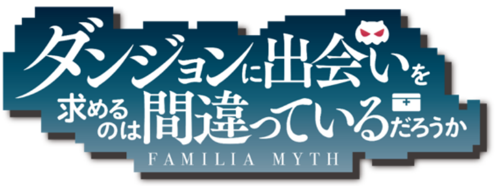
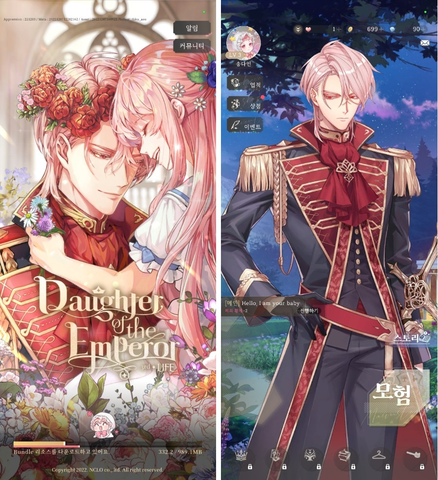
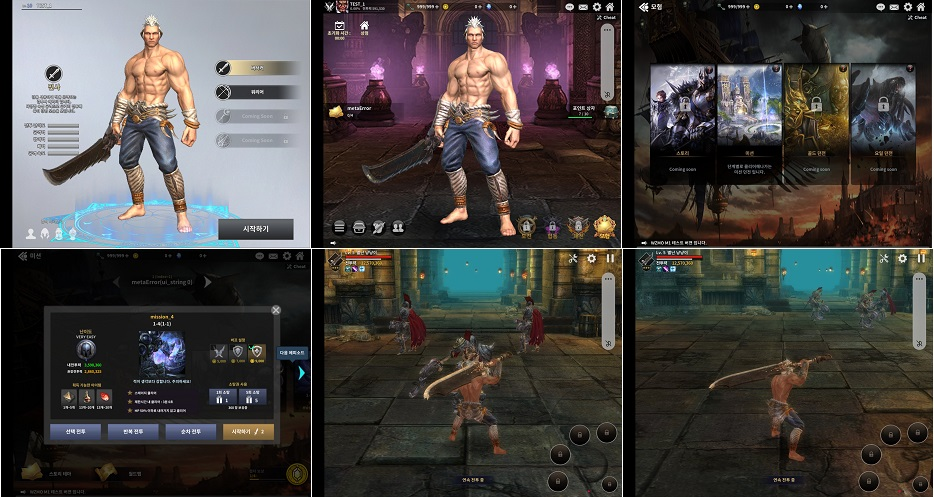
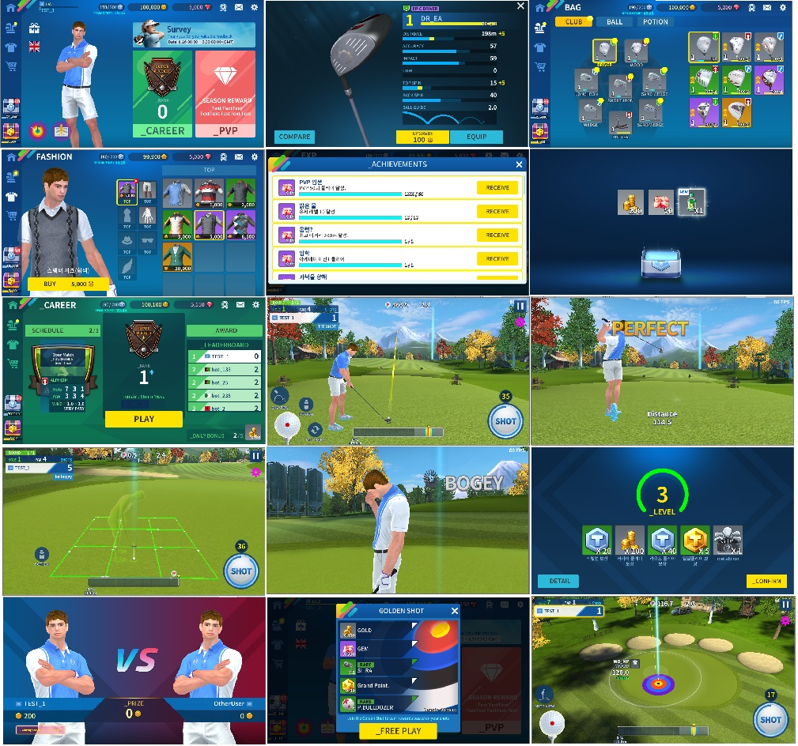
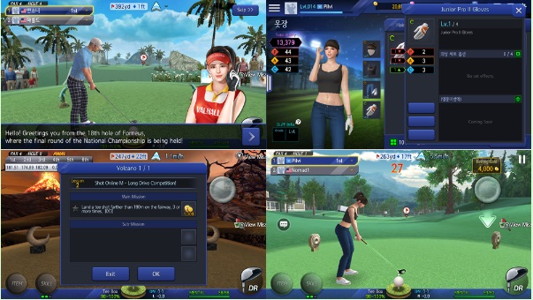
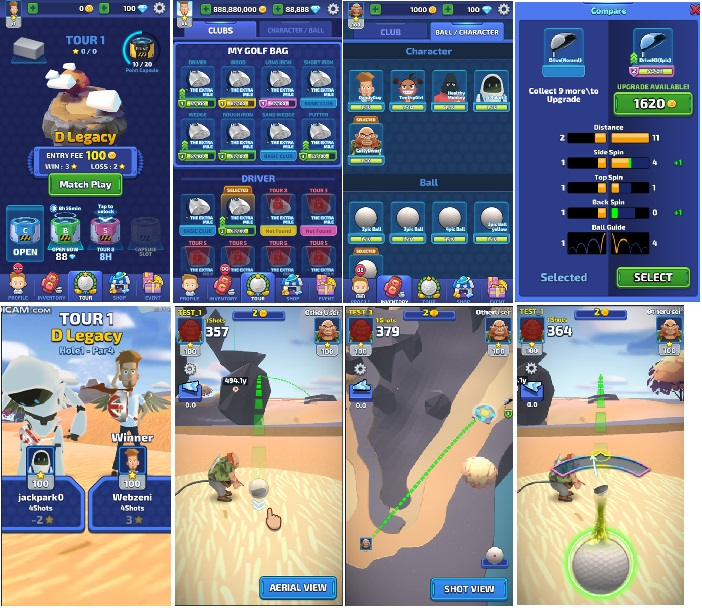
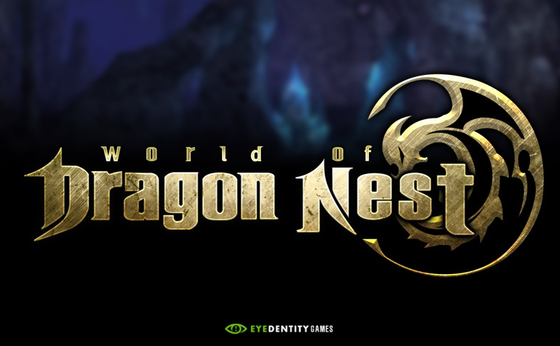
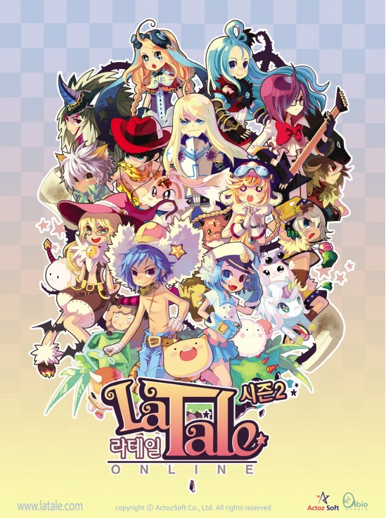

# 이력 및 경력 상세

### 임화용 : 게임 서버 개발자

| Birthday  | 1974. 04. 23                                       |
| --------- | -------------------------------------------------- |
| Email     | [duragonz@naver.com](mailto:duragonz@naver.com)    |
| Mobile    | 010-6825-0077                                      |
| Address   | 경기도 성남시 분당구 분당로 201번길 17 105동 301호 |
| portfolio | https://github.com/duragonz/portfolio              |

## 자기소개   / About Me

동국대학교 대학교 재학중 과내 스터디그룹을 통해 Unix환경과 네트워크 프로그래밍에 대한 기초를 다졌습니다.

2000년도 게임회사에 입사하여 약 22년간 게임 개발자로 개발하였으며, 보드게임, 2D RPG, 3D MMORPG, 스토리 게임등 다양한 장르에서 클라이언트 개발자, 관리자, PD, 서버개발자 등의 다양한 역할을 수행하며 `서버 프로그래밍`과 `게임시스템`에 대한 이해와 경험을 쌓았습니다.

MMORPG 및 보드게임의 설계, 구현, 라이브 서비스를 모두 경험해 보았으며, 차분하며 꼼꼼한 성격으로 주어진 업무를 파악하여 구현 및 문서 정리, 리팩토링을 통해 마감 및 유지보수를 하는데 강점을 가지고 있습니다. 팀에서 서로 협력하며 작업하는 환경에 대해서 잘 이해하고 있으며, 게임 제작은 많은 사람들의 협력해서 `함께 할 때` 더 좋은 가치를 만들어 낼 수 있다고 생각합니다.  내가 만들고 싶은 게임 보다는 PD, 기획자가 만들고자 하는 게임을, 플레이 하는 사람이 즐거울 수 있는, 비즈니스 적으로 가치가 있는 제품을 만들려고 노력하고 있습니다.

감사합니다.

## 학력 사항 / Education

| 재학 기간         | 학교명     | 학과     | 비고 |
| ----------------- | ---------- | -------- | ---- |
| 1998.03 ~ 2001.01 | 동국대학교 | 정보통신 | 졸업 |

## 이력  / Experience 

경력 : 2000.02 - 2023.01 : 22년 10개월

| 재직  기간         | 회사명            | 부서  및 R&R                                       | 비고                                        |
| ------------------ | ----------------- | -------------------------------------------------- | ------------------------------------------- |
| 2023.04 ~ 2024.02  | ㈜네오위즈        | 원테이크스튜디오 프로그램팀                        | 서브컬쳐 모바일 (c# Server)            |
| 2020.10 ~  2023.01 | ㈜ 비비드스튜디오 | 게임개발본부  게임개발실 ㈜ 엔시엘오 사명변경 | 서브컬쳐 모바일 (c# Server)            |
| 2019.12 ~ 2020.09  | ㈜ 웹젠           | 프로젝트C TFT                                      | MMO 모바일 (c# Server)                 |
| 2017.09 ~ 2019.11  | ㈜ 웹젠온네트     | 프로그램실 ㈜ 웹젠 자회사                     | 스포츠, PVP, 모바일 (c# Server)        |
| 2016.01 ~ 2017.08  | ㈜ 아이덴티티     | 모바일본부 WOD팀                                   | MMO 모바일 (c++ Server)                |
| 2006.09 ~ 2016.01  | ㈜ 액토즈소프트   | 아비오스튜디오                                     | MMO PC (c++, DirectX Client)           |
| 2000.02 ~ 2006.03  | ㈜ 팜팜인터테크   |                                                    | 보드 게임 PC (VB, c++, DirectX Client) |
|                    |                   |                                                    |                                             |

## 보유기술   / Skill 

| 구분                  | Skill                                                        |
| --------------------- | ------------------------------------------------------------ |
| Programing  Languages | C++, C#, JavaScript                                          |
| Framework  / Library  | C++ TCP server C# TCP server Asp.Net(운영툴), Node.js(학습),  javascript webui (운영툴) Blazor(Asp.Net Core) |
| DB                    | MySQL(라이브), MSSQL(라이브), mongoDB(학습) Redis(StackExchange) |
| DevOps                | CI(Jenkins), SCM(Git, SVN), Docker EKS, AWS Lambda      |
| Environment           | Windows, Unix (레드햇계열:Cent/Rocky),  AWS, Elasticsearch/kibana |
| 프로토콜 스택         | 인덱스기반 프로토콜 : thrift (like protobuf ) messagePack |

## 강점

#### 다양한 개발 경험

다양한 개발 환경, 다양한 역할의 경험을 통해서 프로젝트에서 필요로 하는 기능을 제작할 수 있습니다.

* 카드게임, 보드게임, 스토리게임, MMORPG등 다양한 게임 제작을 경험
* Item, Skill, Ai, PVP, Mission 등등의 컨텐츠 들과 Excel AddinTool, ScriptTool, MapTool, Web AdminTool 등 다양한 기능 제작
* C++, C#, JavaScript, directX, Unity등의 다양한 언어 경험
* 여러팀에서 팀의 코딩컨벤션에 맞는 개발

#### 모바일 게임 개발 및 런칭, 서비스 경험

모바일 게임의 특징에 맞는 시스템 개발

* socket session과 user session 분리 및 재접속 처리
* packet requester를 통한 연결

라이브 서비스에 필요한 다양한 플랫폼 연동을 경험하였습니다.

* 파이어베이스연동, 라인 채널링, 구글, 애플, 원스토어 결제 연동
* 개발 / 패치 브랜치 및 테스트 환경 설정

* AWS 장비 설정 및 라이브 서비스 진행

#### IDL (Interface Definition Language) 사용 경험

Apache thrift를 이용해서 기획데이터 및 각종 클래스 정의, 프로토콜, DB 통신 정의에 사용

* meta data flatform (thrift를 통해 json schema 생성 및 Excel make > binary)
* querybuilder를 통한 DB통신 자동화

#### 지속적인 통합의 경험 (빌드 자동화 및 개선)

* jenkins를 이용한 빌드 및 배포 자동화
* MsSql to MySql 마이그레이션
* Windows to Linux 서비스 환경 마이그레이션
  * docker 설정 및 관리

#### 글로벌 서비스 경험

* 언어 테이블 분리
* 언어 데이터 테이블 분리 및 통합 로직 작업

#### 시스템 관리 경험

* AWS 서비스 장비 관리
* SVN, Redmine, jenkins 설정 및 관리
  * LDAP 인증 시스템 연동
* SSL인증서 발급 및 적용, 도메인 서버 관리

#### 개발 흐름 전체의 이해

프로젝트의 시작 셋팅부터 라이브서비스까지 진행에 대한 이해

* 하우스, 스테이지, 라이브 서비스 환경 설정 및 패치 시스템

* 라이브 점검 및 패치, 테스트 시스템 (PrivateRouting, WhiteIP)

* Web AdminTool 개발 및 유지보수, 각종 운영 통계 산출

#### 프로그래머 리더 개발자로써의 경험

* 인력 관리 및 스케쥴 관리
  * 직원들의 업무 능력을 파악하고 그에 맞는 일감을 배분
  * 해당 업무의 일정이 늦어지는 원인 파악 후 재분배
* 타 부서와의 일정 조율
* 마일스톤 개발 일정 관리

## 하고 싶은 것

#### 대용량 서버 구축

- 많은 사용자의 이용 및 동시 접속을 허용할 수 있는 서버시스템 구축

#### 재미있는 게임

- 디렉터가 바라보는 게임을 구성하기 위해 함께 노력
- 사용자가 재미있게 즐길 수 있는 게임 구성

#### 게임 개발 자동화

- 게임 개발에서 반복되는 작업에 대한 단순화를 통해 게임 구현에 집중
- QueryBuilder : 서버에서 DB에 접근하는 StoredProcedure의 Loader Code를 자동 생성
- GenTool
  - 기획 데이터 테이블의 Schema를 확인하여 운영툴 관리 페이지, Data Loader를 자동 생성
  - DB user 테이블을 읽어서 운영툴 사용자 정보 관리 페이지를 자동 생성

## 경력 기술 상세

#### 던만추 : 2023.05 ~2024.02, 개발 중단

* 팀구성 : 실장, PD, 시스템기획, 컨텐츠 기획, 연출 기획, 아트실, 클라이언트, 서버
* 담당업무
  * 퀘스트, 미션, 가이드 미션, 튜토리얼, 쿠폰
  * 스트레스 테스트
  * 시스템 개선 : GenTool(Excel To DB & Code Generator), DocTool(문서 자동생성툴)
* 개발 도구
  * VS, Mysql, StackExchange.Redis, jenkins, perforce, docker, AWS (EC2, S3, EKS, RDB, Lambda), ASP.NetCore, Blazor, SignalR
* 특징
  * GenTool : Excel To DB & Code Generator 로 개발 효율 향상
  * Blazor 사용으로 c# 개발환경 통일
  * EKS 환경의 서버 및 StressTest
  * Custom Tool : DBmergeTool, ExcelDiffTool
  * SignalR 을 통한 WebSocket 통신 및 마을 동기화

#### 황제의 외동딸 : 2021.07 ~2022.10, 2022.11월 런칭, 라이브

* 라이브 서비스중 : https://play.google.com/store/apps/details?id=com.vivid.aos.dote
  
* 팀 구성 : PD, TD, AD, TA, 기획(2), 서버(3), 클라(3), 아트팀(6)
  * PD, TD, TA, 기획(2), 클라(3), 서버(1), 아트팀 구성으로 라이브 런칭
* 담당업무
  * 아이템, 인벤토리, 보상 및 저장 시스템, 이벤트 스케쥴
  * 퀘스트, 스테이지 진행, 미션, 업적
    * 스토리 생성 및 변환 시스템 보조
  * 이벤트 : 출석, 플레이이벤트, 기간 출석이벤트, 누적보상 이벤트 
  * 운영툴 작업 : 프런트엔드(Webix, javascript), 백엔드(ASP.Net) 기반 운영툴 작업
    * DB 정보 기반 기초 통계 작업
  * Linux build 환경 설정, Docker 실행 설정
  * Mssql > mysql 마이그레이션
  * 라이브 런칭 및 점검
    * 원스토어 런칭, 구글스토어 런칭
    * 글로벌 서비스 
      * 언어지원 : 한국어, 일본어, 영어, 태국어
* 개발 도구 : VS, VSCode, Mssql, Mysql, dbforge, liquibase, jenkins, svn, git, docker registry, AWS (EC2, S3, RDB, ECR), Node, ASP.NetCore
* 개발 환경 : Window, Ubuntu(wsl), Rocky linux, SVN, GIT, Jenkins, C#, Thrift meta system, Unity
* 특징
  * 썸머코드와 동일한 플랫폼 환경에서 개발 진행, 개발하면서 개선된 사항은 썸머코드 라이브에도 반영
    * Windows 환경에서 Linux 환경으로 변경
    * MsSql > MySql 마이그레이션
    * docker 실행 환경 구성

#### 썸머코드 : 2020.10 런칭, 라이브

* 라이브 서비스 중 : https://play.google.com/store/apps/details?id=com.skyent.summercode.gp

* 팀 구성 : PD, TD, AD, TA, 기획(3), 스토리(3), 서버(3), 클라(3), 아트팀(8)
* 담당업무
  * 라이브 서비스 중인 게임의 개선
  * 아이템, 인벤토리, 보상 및 저장 시스템, 이벤트 스케쥴
  * 스테이지 진행, 미션, 업적
  * 이벤트 : 출석, 플레이이벤트, 기간 출석이벤트, 누적보상 이벤트 
  * 운영툴 작업 : 프런트엔드(Webix, javascript), 백엔드(ASP.Net) 기반 운영툴 작업
  * 라이브 패치 시스템 및 점검 진행
  * 라인 채널링
  * 글로벌 런칭
    * 언어지원 : 한국어, 일본어, 영어, 중국어
    * 글로벌 런칭 시점이 달라서 국가별 컨텐츠 오픈 구성 분리
* 사용 기술
  * 개발 도구 : VS, Mssql, liquibase, jenkins, svn, git, AWS (EC2, S3, RDB), Node, ASP.Net
  * 개발 환경 : Window, SVN, GIT, Jenkins, C#, Thrift meta system, Unity

#### 프로젝트C TFT(웹젠) : 2019.12 ~ 2020.09

* 프로젝트C TFT, RPG 제작 참여
  

* 담당업무 : MetaData, 개발환경 작업, MetaTool (Excel addon), 매칭, PVP 개발

  * thrift 개발환경 관리
    * 개발 환경에 사용되는 TrayTool의 구성 및 관리
  * meta data excel tool 제작
    * 기획 데이터에 사용되는 Excel에서 Addon을 통해서 데이터의 Schema가 연동되도록 구성
      * Enum 연동
      * TableID로 연결된 다른 파일의 데이터 연결 오픈
    * 신규 Meta 파일 생성
    * Meta Pack : Binary 변환 및 압축
  * pvp 매칭 시스템, pvp 월드이동 및 진행
    * PVP 등급, 등급별 매칭, 시즌 랭킹에 따른 승급/강등
    * PVP 게임서버로 이동 및 룰에 따른 결과 처리

* 개발 도구 및 환경 : VS, VSCode, Mssql, jenkins, svn, ExcelAddon, C#, Thrift, Thrift meta system, ExcelAddon, Mssql, Unity

  

#### Shot Mobile 2 (웹젠온네트) : 2018.10 ~ 2019.10

* Shot Mobile 2 시스템 설계 및 기획 설계

  * 팀 구성 : PD, AD, 클라(3), 서버(2), 기획(3), 아트팀 지원

  * 담당업무

    * PD 역할 담당 
      * 게임의 전체적인 방향, 컨셉 설정, 컨텐츠 구성
      * 마일스톤별 개발 계획
      * 재화 순환, 컨텐츠 순환, 사업팀과의 조율

    

* 개발 도구 및 환경 : C#, Thift, Thrift meta system, mssql, nGrinder, windows, Unity

#### 샷온라인 & SOGWC 라이브 관리

* 샷 온라인 PC 게임 라이브 관리
* 샷온라인 월드 챔피언십 라이브/ 샷온라인 라이브 관리

#### Shot Mobile 프로토타입(웹젠온네트) : 2017.10 ~ 2018.02

* 모바일 Shot Mobile 프로토타입 개발 

  

  * 팀 구성 : 클라(1), 서버(1), 기획(1), 원화(1), 아트팀 지원
  * 담당 업무
    * 게임 컨셉설정
    * 게임 진행 흐름 설계 및 서버 구현
    * 인증, 로비 스테이지 구성, 인게임 플레이, 난이도 설정 및 보상 처리
  * 특징
    * 캐주얼 컨셉 설정
    * CopyCat으로 게임 구성 및 프로토타입 제작

#### WOD (아이덴티티)  : 2016.01 ~ 2017.08 

* World Of DragonNest 개발 (https://www.youtube.com/watch?v=ge2qRHnbiRg)
  
* 담당업무 : 스킬, 전투시스템, 버프-디버프, AI, 서버 분산처리 담당
  * 유닛 이동
    * C-S간 위치 동기화 (recast navi)
    * 느슨한 동기화를 통한 위치 보정
  * 스킬, 버프
    * 스킬 타입에 따른 타격 범위 계산 및 버프 적용 
    * 전투 타겟 및 데미지 계산
  * AI : Player와 거리를 기반으로한 스크립트 타입의 몬스터 AI
    * 특수상태를 추가한 Boss AI
  * 서버 분산처리 : grid 기반 Woldmap 구역 설정 및 실시간 서버 이동 처리
    * WordMap Grid 분할 및 Grid간 서버 이동 처리
  * 컨텐츠 : 스킬, 스킬성장, 전투, 인던, 보스레이드
* 개발 도구 및 환경 : VC++, Thrift, Thrift meta system, Json, Mssql, nGrinder, Unity

#### 라테일 온라인(액토즈소프트) : 2006.09 ~ 2016.01, 2006년 10월 런칭, 라이브

* 라테일 온라인(https://www.latale.com/Main/) 클라이언트 개발
  

* 담당업무

  * 라테일 클라이언트 라이브 개발
  * 분기별 라이브 컨텐츠 제작
    * 담당자를 로테이션하며 개발 진행, 거의 전체 시스템에 개발 및 개선 진행
    * MMORPG 컨텐츠 개발
  * UITool 설계 및 개발

* 개발 도구 및 환경 : Windows, DirectX, VC++, 자체개발 DataPackTool, MapTool, UITool 사용

  

#### 팜팜인터테크 : 2000.02 ~ 2006.03

* 온라인 포커 게임 개발

  * 담당업무
    * 클라이언트 개발
    * 개발 도구 및 환경 : Windows, VB6.0, VC++, Linux, PostrgreSQL

* 온라인 포커 게임 확장

  * 담당업무
    * 바둑이, 홀뎀 클라이언트 프로그램 전체 개발
    * 개발 도구 및 환경 : Windows, VB6.0, VC++, Linux, PostrgreSQL

* 보드 게임 확장

  * 담당업무
    * 고스톱, 사천성, 바둑 프로그램 개발 관리
    * 포커 게임 V2 개발 관리
      * VB에서 VC++, DirectX 기반으로 변환
    * 개발 도구 및 환경 : Windows, VC++, DirectX, Linux, PostrgreSQL

* XBox 노래방 'zillernet'타이틀 개발

  * 담당업무
    * 태진과 노래방 음원 리소스 관리
    * XBox Dev Toolkit을 이용한 개발 관리
  * 개발 도구 및 환경 : XBox DeveloperKit 이용, VC++, XBox SDK

  

